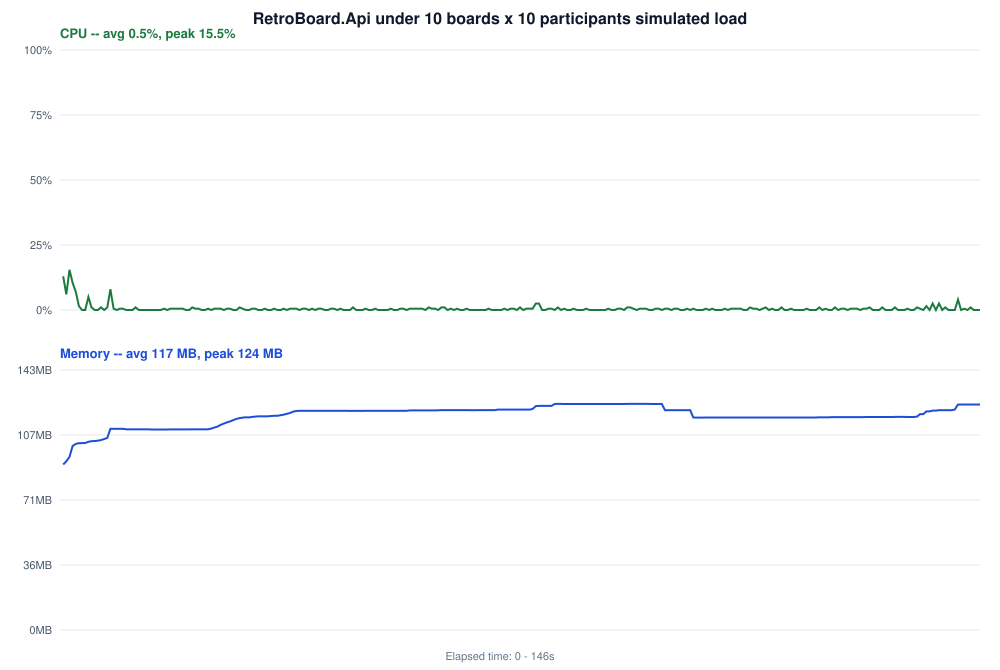

<div align="center">
  

  # RetroBoard

  <em>Real-time, self-hosted sprint retrospective board.</em>

  [](https://github.com/GVLTodorov/RetroBoard/actions/workflows/ci.yml)

  
</div>

---

## Table of Contents

- [What is this?](#what-is-this)
- [Features](#features)
- [Quick start](#quick-start)
- [Tech stack](#tech-stack)
- [Project structure](#project-structure)
- [Testing](#testing)
- [Performance](#performance)
- [Configuration](#configuration)

## What is this?

A single-container web app for running sprint retrospectives: create a board, share a link, add
sticky notes to columns, optionally keep them blurred until revealed, dot-vote on what matters
most, group similar ideas together, and walk away with a tracked action-item list — all over a
real-time connection, no sign-up required. It's a sibling project to
[GVLTodorov/PlanningPoker](https://github.com/GVLTodorov/PlanningPoker) (same author, same "small
self-hosted agile-ceremony tool" shape), reusing that project's stack and conventions. See
[REQUIREMENTS.MD](REQUIREMENTS.MD) for the full spec this was built against.

## Features

- **Create or join a board** in seconds — a friendly board-name suggestion is generated for you,
  and joining via a shared link takes one form submit (Enter works, no extra click).
- **Four column templates** to retro with: Went well / Didn't go well / Action items, Start / Stop
  / Continue, Mad / Sad / Glad, and 4Ls (Liked / Learned / Lacked / Longed for) — picked once when
  the board is created and fixed for its lifetime.
- **Blur-until-reveal writing mode** (optional, set at creation): cards from other participants show
  only a card-count-per-author placeholder until the facilitator reveals that column, to avoid
  anchoring/groupthink. Your own cards are always visible to you immediately.
- **Card grouping**: any participant can drag a card onto another to merge duplicate/similar ideas
  into a stack.
- **Dot voting**: each participant gets a fixed vote budget (default 5, configurable at creation) to
  spread across cards, with a cap per single card (default 3). Vote counts stay hidden from everyone
  until the facilitator ends voting, then reveal all at once.
- **Tracked action items**: the facilitator converts a card into an action item with an optional
  assignee and due date, kept in a dedicated list separate from the column cards.
- **Synced writing timer**: the facilitator starts a countdown (default 5 minutes, configurable)
  that's identical for every participant — server-driven, no per-client drift.
- **Markdown export**: the facilitator can export the whole board (every column's cards plus the
  action-item list) as Markdown, ready to paste into a wiki or ticket.
- **Accessible-by-default styling**: a calm blue/violet palette, large fonts, and generous touch
  targets aimed at comfortable use for participants of any age.

## Quick start

### Local (.NET)

Requires the [.NET 10 SDK](https://dotnet.microsoft.com/download) (the exact version is pinned in
[global.json](global.json)).

```bash
dotnet run --project src/RetroBoard.Api
```

This builds the Blazor client, hosts it as static files, and serves the API/real-time hub from the
same process. Open the URL printed in the console (e.g. `http://localhost:6233`).

Debugging from VS Code: open the repo folder and press **F5** — [.vscode/launch.json](.vscode/launch.json)
is already wired up to build and launch `RetroBoard.Api`.

### Docker

```bash
docker compose up --build
```

Serves the app on [http://localhost:8141](http://localhost:8141) (see
[docker-compose.yml](docker-compose.yml)). No environment variables to configure — RetroBoard has no
required or optional external integrations, so it runs fully featured out of the box.

## Tech stack

.NET (ASP.NET Core Minimal API) + Blazor WebAssembly, one language end-to-end, single container
image, no separate JS/npm toolchain. Real-time board state (join/write/reveal/vote/advance) is
pushed over SignalR with a source-generated JSON payload; REST endpoints handle board
creation/lookup, template metadata, and the Markdown export.

## Project structure

The solution ([RetroBoard.slnx](RetroBoard.slnx)) sits at the repo root; every project lives under
`src/`, one folder per project, split along dependency lines:

```
src/RetroBoard.Infrastructure/     Domain rules (Board/Column/Card/Participant/ActionItem, no
                                    ASP.NET dependency) + wire request/response models and the JSON
                                    source-gen context, shared by Api and Client
src/RetroBoard.Api/                Minimal API + SignalR hub; hosts the Client's output
src/RetroBoard.Client/             Blazor WebAssembly frontend
src/RetroBoard.Tests.Unit/         xUnit: domain logic, board id/name generation, template catalog,
                                    JSON round-trips, contract mapping
src/RetroBoard.Tests.Component/    bUnit: Blazor component behavior
src/RetroBoard.Tests.Integration/  WebApplicationFactory + a real SignalR client, full hub flow and
                                    the REST endpoint surface
src/RetroBoard.Tests.Play/         Playwright: drives 5 real browser sessions through the actual
                                    UI to record the README's demo GIF (manual, see Testing below)
src/RetroBoard.Tests.LoadTest/     N boards x M participants over real SignalR connections,
                                    reporting AddCard/export latency under load (manual)
src/RetroBoard.Tests.Benchmarks/   BenchmarkDotNet: domain hot paths (AddCard/CastVote/GetState)
                                    and hub-message serialization (source-gen vs. reflection)
src/RetroBoard.Tests.Play.Hundred/ Console tool: 10 boards x 10 participants over real SignalR
                                    connections (no browser), samples the API's own CPU/memory
                                    while they write -- draws docs/hundred-resource-usage.svg
```

The Client depends only on Contracts — never Domain — so the browser bundle never ships
server-side validation logic.

## Testing

```bash
dotnet test RetroBoard.slnx
```

Runs the unit, component, and integration suites together. The [CI workflow](.github/workflows/ci.yml)
runs the same command on every push/PR and gates the version-bump/image-build/push job on it
passing. It also collects code coverage and publishes an HTML report (the `coverage-report`
artifact) plus a summary in the job summary — informational only, not gated on a threshold.

The same CI workflow also runs two non-gating perf jobs on every push/PR: `bundle-size` (checks
the published Blazor WASM bundle's Brotli size against a budget,
[script](src/RetroBoard.Client/scripts/check-bundle-size.ps1)) and `benchmarks` (BenchmarkDotNet
over `RetroBoard.Tests.Benchmarks`, results published to the job summary).

`RetroBoard.Tests.Integration` includes a small, deliberately isolated
`BoardHubDisconnectSweepTests.cs` file whose tests each wait out a real 15-second reconnect/empty-
board grace period (see [REQUIREMENTS.MD Section 5.4.5](REQUIREMENTS.MD#54-card-lifecycle)) — those
three tests alone take about a minute; everything else in the suite is fast.

Three manual, non-gated tools round out the suite (not run by `dotnet test`, triggered from the
Actions tab):

- [Demo Video workflow](.github/workflows/demo-video-5p.yml) runs `RetroBoard.Tests.Play`, which
  drives 5 real headless-Chromium sessions through the actual UI (join → write → reveal → vote →
  advance to action items → convert) and commits the regenerated `docs/demo.gif`.
- [Load Test workflow](.github/workflows/load-test-100.yml) runs `RetroBoard.Tests.LoadTest`
  (100 boards x 5 participants x 3 cards each by default — configurable via workflow inputs —
  then an export per board) and reports `AddCard`/export latency percentiles to the job summary.
- [Demo Load workflow](.github/workflows/demo-load-100p.yml) runs `RetroBoard.Tests.Play.Hundred`
  (see [Performance](#performance) below) and commits the regenerated
  `docs/hundred-resource-usage.svg`.

## Performance



`RetroBoard.Tests.Play.Hundred` drives 10 boards x 10 participants (100 real SignalR connections,
no browsers) writing cards at a human pace — each board's round takes 15-20 wall-clock seconds,
with cards landing at random moments rather than all at once — while sampling `RetroBoard.Api`'s
own CPU% and working-set memory. It exists purely to see what the app costs under sustained
concurrent load. Trigger the [Demo Load workflow](.github/workflows/demo-load-100p.yml) from the
Actions tab to regenerate and commit the chart above, or run it manually against a live instance:

```bash
dotnet run --project src/RetroBoard.Tests.Play.Hundred -- http://localhost:6233 <api-pid> docs/hundred-resource-usage.svg
```

## Configuration

None required. RetroBoard has no external integrations (unlike PlanningPoker's optional Giphy
avatars) — every feature works with zero environment variables set. [docker-compose.yml](docker-compose.yml)
at the repo root is the minimal, portable example — build locally, no reverse proxy required.
